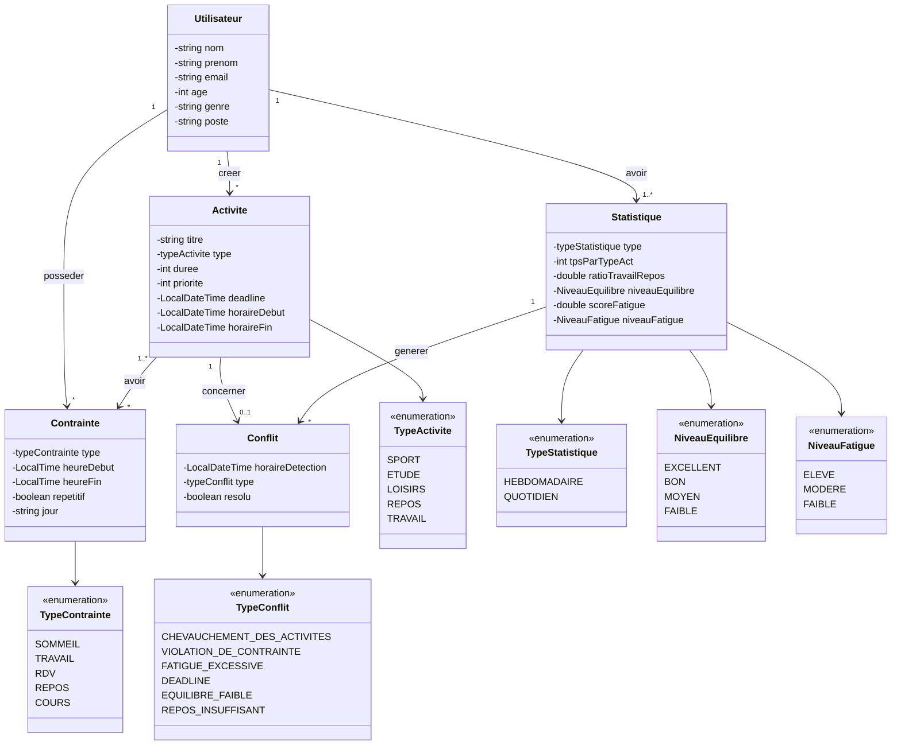

# Planification personnelle intelligente

<div align="center">


**Un socle Java pour construire une planification personnelle plus claire, équilibrée et intelligente.**

[Présentation](#-présentation) · [Fonctionnalités](#-fonctionnalités) · [Installation](#-installation) · [Architecture](#-architecture) · [Feuille de route](#-feuille-de-route)

</div>

<br>

## ✨ Présentation

**Planification personnelle intelligente** est un projet Java dédié à la modélisation d'un agenda personnel prenant en compte les contraintes du quotidien et les conflits de planification.

Le dépôt propose un **socle complet de planification** : gestion des utilisateurs, activités, contraintes et conflits, API HTTP, interface web et optimisation d'un planning selon plusieurs critères.

> Le projet est en développement actif. Les fonctionnalités affichées comme « à venir » ne sont pas encore implémentées.

## 🎯 Fonctionnalités

### Disponibles

- Gestion des utilisateurs, activités, contraintes et conflits.
- Détection des chevauchements et des violations de contraintes.
- Calcul d'un score de planning et optimisation par itérations.
- Persistance des données dans MySQL via une couche DAO et des services métier.
- API HTTP pour l'authentification, les activités, les contraintes, les conflits et les statistiques.
- Interface web avec tableau de bord, calendrier, activités, contraintes, conflits, statistiques et profil.

### À venir

- Renforcement de la couverture des tests et de la validation des entrées.
- Gestion de configuration externalisée pour les accès MySQL.
- Packaging automatisé et déploiement simplifié.

## 🧰 Technologies

| Technologie | Utilisation |
| --- | --- |
| Java | Backend, services et logique d'optimisation |
| MySQL | Persistance des données |
| HTML / CSS / JavaScript | Interface web |
| Gson | Sérialisation JSON de l'API |
| Eclipse | Environnement de développement actuel |
| Git / GitHub | Versionnement et collaboration |

## 🚀 Installation

### Prérequis

- Java Development Kit (JDK) 17 ou une version supérieure.
- MySQL Server avec une base `personal_planner`.
- Git, si vous souhaitez cloner le dépôt.
- Eclipse IDE (facultatif, mais recommandé pour la configuration actuelle).

Le connecteur JDBC MySQL est fourni à la racine du projet. Vérifiez également les dépendances Servlet et Gson utilisées par le serveur embarqué.

### Cloner le projet

```bash
git clone https://github.com/kchaou-mariem/Planification_personnelle_intelligente.git
cd Planification_personnelle_intelligente
```

### Préparer la base de données

Créer la base puis exécuter le script SQL fourni :

```sql
CREATE DATABASE personal_planner;
```

```bash
mysql -u root -p personal_planner < personal_planner.sql
```

Les paramètres par défaut sont `localhost:3306`, utilisateur `root` et mot de passe vide. Ils sont définis dans `src/config/Connect.java`.

### Compiler avec le JDK

Depuis la racine du projet :

```bash
mkdir -p bin
javac -cp "mysql-connector-j-9.5.0.jar;lib/*" -d bin $(find src -name "*.java")
```

Sous PowerShell :

```powershell
New-Item -ItemType Directory -Force bin | Out-Null
javac -cp "mysql-connector-j-9.5.0.jar;lib/*" -d bin (Get-ChildItem -Recurse src -Filter *.java).FullName
```

Sur Windows PowerShell, adaptez le classpath si les dépendances Servlet et Gson sont placées dans un autre dossier.

### Lancer l'application

Pour exécuter le scénario de démonstration et d'optimisation :

```powershell
java -cp "bin;mysql-connector-j-9.5.0.jar;lib/*" Main
```

Pour démarrer le frontend et l'API sur [http://localhost:8085](http://localhost:8085) :

```powershell
java -cp "bin;mysql-connector-j-9.5.0.jar;lib/*" EmbeddedServer
```

### Ouvrir dans Eclipse

1. Importer le dossier comme **Existing Projects into Workspace**.
2. Vérifier que `src` est le dossier source et `bin` le dossier de sortie.
3. Sélectionner un JDK 17+ dans les propriétés du projet.
4. Lancer un *Project > Build Project*.

## 🧭 Architecture

Le code source est organisé par domaine métier :

```text
src/
├── Entities/       # Modèle métier
├── dao/            # Accès aux données
├── service/        # Règles métier et optimisation
├── controller/     # API HTTP
├── config/         # Connexion MySQL
├── test/           # Scénarios de test
└── webapp/view/    # Pages, styles et scripts frontend
```



## 🤝 Contribution

Les contributions sont les bienvenues :

1. Créer une branche dédiée à la fonctionnalité.
2. Ajouter ou mettre à jour les tests concernés.
3. Vérifier que le projet se compile avec un JDK 17+.
4. Ouvrir une *pull request* en décrivant clairement le changement.

## 📌 Feuille de route

```text
Modèle métier       ██████████ 100 %
API et services     ██████████ 100 %
Interface web       ██████████ 100 %
Optimisation        ████████░░  80 %
Tests               ██████░░░░  60 %
Déploiement         ░░░░░░░░░░   0 %
```

## 📄 Licence

La licence du projet sera précisée prochainement.

<div align="center">

Développé avec Java et l'envie de rendre la planification quotidienne plus simple.

</div>